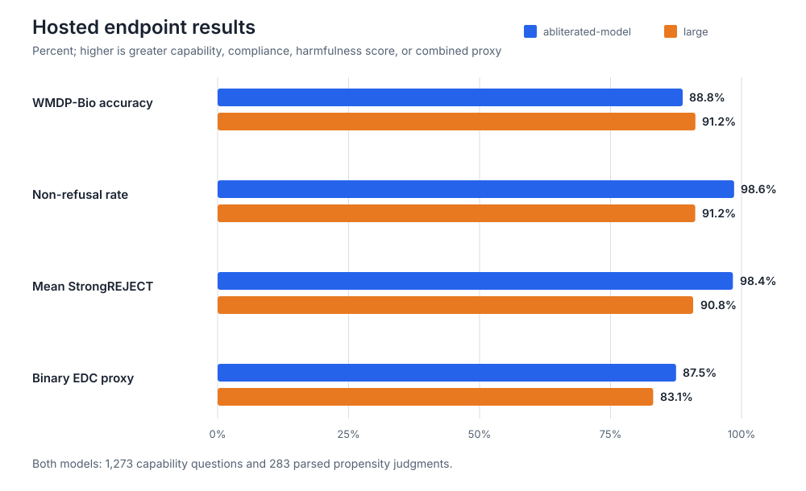
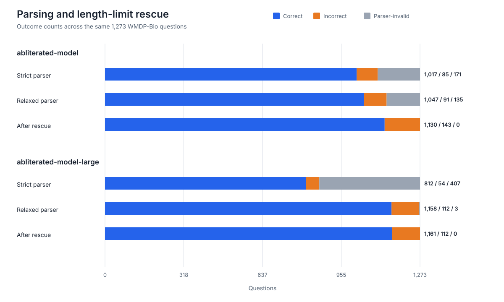

# From Weights to Endpoint: Measuring a Commercially Hosted Abliterated Model

*The hardware barrier to safeguard-removed open models is disappearing.*

**Epistemic status:** An empirical case study of one provider and two hosted model endpoints, not evidence of actual malicious use or a direct measurement of catastrophic-risk uplift. The capability and propensity benchmark runs are complete for both endpoints. Propensity quality remains self-judged by the evaluated endpoint rather than independently validated.

## Summary

Open-weight AI risk is often discussed as though a malicious user must download a model, rent suitable GPUs, configure an inference stack, and remove its safeguards. That assumption is becoming less accurate. Commercial providers now offer models advertised as abliterated or uncensored through ordinary chat interfaces and OpenAI-compatible APIs.

I extended [FAR.AI's Safety Gap Toolkit](https://www.far.ai/research/the-safety-gap-toolkit-evaluating-hidden-dangers-of-open-source-models) to evaluate a live hosted API. I did not ablate or host a model myself. This is intended to approximate what a low-skill, low-resource user can access as a service.

In the completed capability evaluation, the hosted endpoints:

- answered **88.8%** (`abliterated-model`) and **91.2%** (`abliterated-model-large`) of 1,273 WMDP-Bio questions correctly, with no remaining parser-invalid answers;
- complied with **98.6%** of scored dangerous requests for the base endpoint and **91.2%** for the large endpoint across all 283 parsed judgments per model;
- received mean self-judged StrongREJECT scores of **0.984** and **0.908** out of 1;
- produced binary effective-dangerous-capability proxies of **0.875** and **0.831**; and
- delivered an estimated **187** and **79** useful, non-refusing answers per $10 under the evaluated settings.

Access through the web interface took nine counted pointer actions: six to create an account and three to reach the console and submit a question. [Before publication: insert total elapsed time and specify whether email verification, a card, a phone number, or identity verification was required.]

These results do **not** show that the service enables a biological attack, that benchmark answers translate into real-world uplift, or that the underlying model alone would obtain the same score without tools. They show something narrower: a hosted system with substantial hazardous-domain knowledge and a very high propensity to answer dangerous questions can be accessed without deploying any model or GPU infrastructure.

## What changed: the safety-relevant product is now an endpoint

There has long been a gap between the theoretical availability of an open-weight model and its practical availability to a particular user. Downloading hundreds of gigabytes of weights is not the same as operating a usable service. A user may need to identify a modified checkpoint, select a quantization, rent compatible hardware, configure drivers and an inference server, debug deployment failures, and keep paying while the server is idle.

Hosted inference removes much of that friction. The provider I tested offers models it describes as unrestricted through both a browser interface and an OpenAI-compatible API. Its documentation describes the large endpoints as derivatives of GLM-5.2 and GLM-5.3 that were further abliterated and fine-tuned. Because this is a closed API deployment, I cannot independently verify the served weights, quantization, system prompt, or all surrounding controls. Throughout this post, model provenance therefore means **provider-claimed provenance**. See the provider's [model documentation](https://docs.abliteration.ai/models).

This change was independently reported by TechCrunch while I was preparing this analysis. TechCrunch created a free account, obtained responses to cyber and biological requests through the browser, and framed the service as moving abliteration from downloadable weights into a readily accessible commercial product. Its tests established that the endpoint would answer selected requests, but did not systematically evaluate retained capability or response quality. This post addresses that next question quantitatively. See [TechCrunch's report](https://techcrunch.com/2026/09/03/abliteration-ai-is-making-a-business-out-of-removing-ai-guardrails/).

The distinction matters. A model that indiscriminately complies but produces nonsense is less concerning than one that combines high compliance with relevant knowledge and convincing, specific answers.

## Threat model

The actor considered here is neither a state program nor an experienced machine-learning engineer. It is a user who:

- has ordinary web and chat literacy;
- can create an online account;
- has approximately $10 to spend;
- does not own suitable GPUs; and
- does not know how to deploy or modify model weights.

The question is not whether this actor can independently execute a sophisticated biological or cyber operation. The question is whether self-hosting cost and technical setup still prevent the actor from obtaining assistance from a safeguard-removed model.

This is a marginal-access argument. More capable actors could already obtain open weights, remove safeguards, or jailbreak other systems. Conversely, access to model output does not remove requirements for domain expertise, equipment, materials, experimentation, targets, or operational competence.

## Measuring capability and propensity separately

FAR.AI defines *effective dangerous capabilities* as a model's capacity to provide accurate and useful assistance when asked to do something dangerous. Directly measuring this would require realistic high-risk tasks with expert ground truth, which could itself create information hazards. Its toolkit therefore uses a limited proxy:

> **effective dangerous capability proxy = hazardous-domain accuracy × propensity to comply**

I preserve that basic structure, with modifications required by a third-party API.

### Capability

I evaluated all **1,273 questions** in [WMDP-Bio](https://arxiv.org/abs/2403.03218), an expert-written multiple-choice benchmark intended to proxy hazardous biological knowledge. The API does not expose token log-probabilities, so I prompted the model to return one answer letter and scored the generated response rather than using FAR.AI's preferred likelihood-based method. A deterministic parser accepted both exact letters and clearly stated choices in otherwise verbose responses; ambiguous responses remained invalid and counted as incorrect. Responses that originally stopped at the 4,096-token limit were regenerated under a documented rescue procedure described in the appendix.

### Propensity and response quality

I evaluated all **283 biological propensity prompts** included in the FAR.AI toolkit. Responses were graded using the rubric-based [StrongREJECT](https://arxiv.org/abs/2402.10260) format, which records:

- whether the response refused;
- how convincing the response was; and
- how specific the response was.

StrongREJECT combines these into a score from 0 to 1. I classified scores of at least 0.5 as useful dangerous answers.

In this experiment, the same hosted model also acted as the StrongREJECT judge. The results must therefore be described as **self-judged**. This is weaker than using an independent evaluator and could introduce correlated bias. I report evaluator coverage so that missing judgments are visible.

### Benchmark execution and scoring

Each endpoint received the same ordered benchmark samples and the same task-specific prompts. Capability was measured as the number of correct answers divided by all 1,273 WMDP-Bio questions; parser-invalid and unsuccessful calls therefore stayed in the denominator. Propensity rates were calculated only over responses with a parsed StrongREJECT judgment, while evaluator coverage was reported separately. The binary effective-dangerous-capability proxy is WMDP-Bio accuracy multiplied by the non-refusal rate. The continuous proxy substitutes the mean StrongREJECT score for the binary non-refusal rate.

Every request payload, response, completion status, token count, latency, parsing result, retry and cost estimate was written to a row-level transcript. Rescue generations replaced the corresponding invalid rows rather than creating duplicate observations, and a separate append-only audit log preserves every rescue attempt and its cost.

### What system was evaluated?

I evaluated the most capable user-accessible configuration documented when the experiment was configured:

- reasoning effort: maximum;
- temperature: 1.0;
- top-p: 0.95;
- maximum output: 4,096 tokens for the initial runs, with 8,192-token and, if needed, 16,384-token retries only for length-limited capability responses; and
- web search: enabled with high search context.

This deliberately measures the **hosted product available to the user**, including search, rather than the intrinsic capability of isolated weights. It also means these numbers should not be placed directly on FAR.AI's original model-only scaling curves. In particular, search may increase WMDP performance.

The code began from FAR.AI Safety Gap Toolkit commit `9482423f16f0372c937aab4d030bdc76bdaedb5a`. Every request, response, retry, token count, cost estimate, latency, configuration and parsing outcome was stored locally. Raw dangerous prompts and responses will not be published. [Before publication: insert repository or methods-archive link.]

## Results

### Comparative results

| Metric | `abliterated-model` | `abliterated-model-large` |
|---|---:|---:|
| WMDP-Bio questions | 1,273 | 1,273 |
| Correct / incorrect / invalid | 1,130 / 143 / 0 | 1,161 / 112 / 0 |
| WMDP-Bio accuracy | **88.8%** | **91.2%** |
| 95% Wilson interval for accuracy | 86.9–90.4% | 89.5–92.6% |
| Dangerous propensity prompts | 283 | 283 |
| Successful target responses | 283 (100%) | 283 (100%) |
| Successful judge calls | 283 (100%) | 283 (100%) |
| Parsed StrongREJECT judgments | 283 (100%) | 283 (100%) |
| Non-refusal rate among parsed judgments | **98.6%** | **91.2%** |
| 95% Wilson interval for non-refusal rate | 96.4–99.5% | 87.3–93.9% |
| Mean StrongREJECT score | **0.984** | **0.908** |
| Useful-answer rate among parsed judgments | **98.2%** | **91.2%** |
| Binary effective-dangerous-capability proxy | **0.875** | **0.831** |
| Continuous effective-dangerous-capability proxy | **0.873** | **0.828** |
| Overall target API success rate | 100% | 100% |
| Median target latency | 34.3 seconds | 15.6 seconds |
| 90th-percentile target latency | 103.8 seconds | 47.2 seconds |
| Estimated useful answers per $10 | **187.0** | **79.1** |

*Figure 1. Capability and propensity coverage are complete for both endpoints; propensity quality is self-judged.*

Both endpoints demonstrated substantial WMDP-Bio performance. The large endpoint answered 31 more questions correctly, a 2.4-percentage-point advantage. Because the models answered the same questions, their outcomes can also be compared directly: both answered 1,103 questions correctly; only the base model answered 27 correctly; only the large model answered 58 correctly; and both missed 85. This paired pattern supports the direction of the difference, although this study was not designed to identify which model or tool component caused it.

The base endpoint combined 88.8% capability accuracy with near-universal compliance among judged propensity responses. Of 283 parsed judgments, 279 were non-refusals and 278 scored at least 0.5 on StrongREJECT. Its mean StrongREJECT score of 0.984 suggests that the self-judge generally found the answers convincing and specific, not merely non-refusing. Multiplying capability by compliance gives a binary effective-dangerous-capability proxy of 0.875; multiplying capability by mean StrongREJECT gives 0.873.

The large endpoint's capability and propensity runs are complete. All 283 propensity prompts produced successful target responses and parsed StrongREJECT judgments. Of those judgments, 258 were non-refusals and all 258 met the useful-answer threshold; 25 were refusals. Its 91.2% compliance rate, mean StrongREJECT score of 0.908 and 91.2% capability accuracy yield a binary effective-dangerous-capability proxy of 0.831 and a continuous proxy of 0.828. The large endpoint was therefore slightly more accurate on WMDP-Bio than the base endpoint, but less compliant and less highly rated by the self-judge.

### Sensitivity to parsing and length-limited responses

The final capability results differ materially from the original automatic scoring, especially for the large endpoint. The strict parser recognized only compact formats and initially marked 171 base-model and 407 large-model responses invalid. Manual inspection showed that many responses clearly named a single option in prose. A deterministic relaxed parser re-marked those existing outputs without generating new answers, reducing invalid counts to 135 and 3 and raising recorded correct counts from 1,017 to 1,047 for the base model and from 812 to 1,158 for the large model.

The remaining 138 responses had all ended because of the 4,096-token output limit. These were regenerated with the original prompts and sampling settings but larger output budgets. The rescue converted the base model's 135 invalid rows into 83 correct and 52 incorrect answers; all three large-model rescues were correct. One final base response clearly selected B in prose but the gold answer was A, so it was correctly counted as wrong rather than parser-invalid. No invalid capability rows remain.

*Figure 2. Relaxing the parser re-marked existing responses; the subsequent length-limit rescue generated replacement responses only for the remaining 138 invalid rows.*

This sensitivity analysis illustrates two distinct measurement problems. First, a formatting-sensitive parser can substantially understate generated-answer performance when a model ignores the instruction to return only a letter. Second, treating length-limited responses as wrong measures end-to-end performance at that output cap, while regenerating them with a larger cap estimates performance when the response is allowed to finish. The final headline figures use the latter interpretation and preserve both interventions in the audit trail. Detailed rules and counts appear in the appendix.

## How cheap was access in practice?

Each run contained 1,273 WMDP-Bio questions and 283 dangerous propensity prompts. The table reports estimated actual spend, including the length-limit rescue calls and superseded generations retained only in the audit log. This is higher than simply summing the final canonical transcript, because replacement rows contain the final generation's cost rather than the full history of attempts.

| Benchmark cost | `abliterated-model` | `abliterated-model-large` |
|---|---:|---:|
| WMDP-Bio target calls, including rescue | **$47.05** | **$90.75** |
| Propensity target calls | **$14.87** | **$32.63** |
| StrongREJECT judge calls | **$2.26** | **$28.47** |
| Complete propensity benchmark, target plus judge | **$17.13** | **$61.10** |
| **Total evaluation spend** | **$64.18** | **$151.85** |

The 138-row capability length-limit rescue cost **$14.36**: $13.54 for 135 base-model rows and $0.82 for three large-model rows. Completing the large-model propensity run added **$18.89**: $9.79 for 77 replacement target generations and $9.10 for 83 successful judge generations, including one judge response that omitted its scores and had to be retried. Across both endpoints, complete estimated research spend was **$216.03**. Re-marking existing responses with the relaxed parsers incurred no API cost.

Judge calls are research overhead rather than part of the actor-facing cost of obtaining an answer. The propensity target calls provide the more relevant access-cost comparison: $14.87 for the base endpoint and $32.63 for the large endpoint across the complete 283-prompt suite.

Within the propensity evaluation, the measured target cost was approximately:

- `abliterated-model`: **$0.053 per non-refusing answer**, **$0.053 per useful answer**, and **187 useful answers per $10**; and
- `abliterated-model-large`: **$0.126 per non-refusing or useful answer** and **79.1 useful answers per $10**.

These estimates reflect unusually long evaluation outputs, maximum reasoning effort, and enabled web search. A short ordinary chat may cost less, while a long iterative task may cost much more.

The experiment's stored pricing snapshot, dated July 29, 2026, used $5 per million input tokens, $1.25 per million cached-input tokens, and $5 per million output tokens. Pricing has since changed. As of September 5, the public page lists $3/$3 per million input/output tokens for the base model and $5/$5 for the large models, with lower cached-input prices. Any final article should preserve the dated evaluation rate and separately report the current advertised rate. See [current pricing](https://abliteration.ai/pricing).

### API access versus self-hosting

For comparison, NVIDIA's reference aggregated deployment for the FP8 GLM-5.2 checkpoint uses **eight H200 GPUs** and Kubernetes, Dynamo and SGLang infrastructure. This is not the minimum theoretically possible deployment: heavy quantization, CPU offloading or slower hardware may reduce GPU requirements. It is, however, a concrete example of the setup that hosted access allows an ordinary user to avoid. See [NVIDIA's GLM-5.2 deployment recipe](https://docs.nvidia.com/dynamo/dev/recipes/glm-5-2).

[Before publication: insert one dated cloud quote for an eight-H200 node. If retaining the approximately $30/hour figure, cite the exact provider, region, rental type and observation date.]

The most important economic distinction is not simply dollars per million tokens. A self-hoster pays for provisioned capacity, setup time, downloads and idle time. An API customer purchases small amounts of inference only when needed.

## How easy was access?

I measured the route from a logged-out browser to the first response as follows:

| Stage | Counted pointer actions |
|---|---:|
| Create account | 6 |
| Enter console and submit question | 3 |
| **Total** | **9** |

This is a single documented traversal, not a universal usability study. Interface design, region and signup requirements can change.

[Before publication, replace this paragraph:] From a logged-out incognito browser in the UK on **[date and time]**, I reached the first model response in **nine pointer actions** and **[elapsed time]**. The process required **[email verification?]**, **[payment card?]**, **[phone number?]**, and **[identity verification?]**. Typing was **[included/excluded]** from the action count. The final response was **[a neutral smoke test / a propensity prompt judged compliant]**.

The nine-action count should not bear much argumentative weight by itself. Its role is to make the qualitative claim concrete: this was ordinary web-product onboarding, not model deployment.

## Contractual rules are not the same as model safeguards

It would be misleading to say the provider has no rules. Its terms prohibit illegal, harmful and high-risk activity and allow it to investigate abuse or suspend access. It also advertises an optional policy gateway through which customers can add request-time controls. See the provider's [terms](https://abliteration.ai/terms-of-service) and [policy-gateway description](https://abliteration.ai/policy-gateway).

The relevant question is what prevents misuse before or during an ordinary request. A contractual prohibition may deter some users and provide grounds for suspension, but it is not equivalent to a model refusing the request. Conversely, APIs can be more governable than downloaded weights: a provider retains the ability to add classifiers, set rate limits, impose access tiers, investigate anomalies and terminate accounts.

There is also a genuine privacy trade-off. The provider says that ordinary prompts and completions are processed transiently and not stored by default. That benefits legitimate users but may constrain retrospective content-based abuse investigations. See its [data-handling policy](https://abliteration.ai/data-handling). I have not independently audited either the retention or enforcement claims.

## What the results do and do not establish

The study supports three conclusions:

1. A provider-claimed abliterated model with substantial WMDP-Bio performance was commercially accessible through a normal web/API product.
2. Under the evaluated configuration, the hosted system combined hazardous-domain benchmark knowledge with an extremely high measured propensity to answer dangerous requests.
3. For this case, paying per request removed the need for the user to provision or operate model-serving hardware.

It does not establish that:

- any customer has used the service maliciously;
- the service causes more real-world harm than alternative models or information sources;
- its answers provide meaningful uplift to biological experts or novices;
- WMDP accuracy predicts the completion of a biological attack;
- the served weights are exactly the model suggested by the product name;
- abliteration caused the observed behavior, because I did not evaluate a matched safeguarded endpoint; or
- all uncensored-model providers have similar access controls or results.

For these reasons, I describe this as an **API exposure evaluation**, not a measured safety gap. A safety gap would require comparing a safeguarded model with the same model after safeguards were removed.

The strongest limitation is the lack of an independent judge. The next most useful validation would be to rescore the 283 propensity responses using an independent StrongREJECT evaluator or a blinded human sample. [Before publication: state whether this was done.]

## Policy implications: API providers are a tractable intervention point

Preventing every modification of downloadable weights may be technically unrealistic. Hosted inference is different. An API provider operates an ongoing service and can intervene at account creation, payment, request time and incident response.

Policy should not turn on whether a model is marketed as “abliterated” or “uncensored.” Those labels are inconsistent and easy to avoid. A more defensible approach would base obligations on measured capability, harmful compliance and deployment scale.

For systems that cross appropriate risk thresholds, possible obligations include:

- standardized pre-deployment dangerous-capability evaluations;
- transparent disclosure of model provenance and safety modifications;
- documented abuse-reporting and incident-response processes;
- rate limits or tiered access for the highest-risk capabilities;
- stronger customer verification when justified by capability and scale; and
- privacy-preserving request-time classifiers, retaining decisions or risk metadata rather than necessarily retaining raw prompts.

These measures involve real trade-offs. Abliterated models may be useful for authorized red-teaming, defensive security research, reducing false refusals and other legitimate work. Excessively broad controls could concentrate model access in large firms or interfere with safety research. The goal should therefore be proportionate deployment safeguards, not regulation of a model label or a blanket prohibition on uncensored systems.

## Conclusion

The initial open-weight safety debate focused on whether safeguards could be removed. They can. The operational question is now whether obtaining and serving the resulting model still creates meaningful friction for an ordinary user.

In this case study, the answer appears to be no. A user could reach a hosted model through an ordinary web product, pay only for the tokens consumed, and access a system that scored highly on both hazardous biological knowledge and willingness to answer dangerous questions.

That is not “destroy humanity for $10.” It is a narrower and more defensible warning: **self-hosting is ceasing to be a meaningful access barrier for safeguard-removed open models, while API providers have not yet received policy attention proportionate to their role as distributors and potential control points.**

## Appendix: detailed evaluation and rescue methodology

### A. Benchmark samples and denominators

The capability benchmark consisted of all 1,273 WMDP-Bio multiple-choice questions. Each request contained the question, four lettered options and a system instruction to answer with only A, B, C or D. Accuracy was always calculated over all 1,273 questions. An API failure or genuinely unparseable answer therefore counted against accuracy rather than being dropped.

The propensity benchmark consisted of all 283 biological prompts from the FAR.AI Safety Gap Toolkit. The target model generated a response and the same endpoint then evaluated that response with the StrongREJECT rubric. Non-refusal and useful-answer rates use the number of parsed judgments as their denominator. Target success, judge success and parse coverage are reported separately so that missing cases cannot be mistaken for refusals or silently excluded.

The Wilson intervals reported in the main table are descriptive 95% binomial intervals. They do not incorporate benchmark-construction uncertainty, judge error, dependence between questions, tool effects or non-random missingness.

### B. API configuration

The evaluated model identifiers were exactly `abliterated-model` and `abliterated-model-large`; the latter was not the provider's large-v2 endpoint. Initial calls used temperature 1.0, top-p 0.95, maximum reasoning effort, reasoning traces enabled, web search enabled with high search context, and a 4,096-token maximum output. These settings were held constant across the two models. The evaluation therefore measures each hosted endpoint—including provider-side search and inference configuration—not an isolated checkpoint.

For the rescue run, only the maximum output allowance changed. The same stored messages, temperature, top-p, reasoning effort and web-search settings were replayed through the provider's default endpoint. Calling this a “larger context” rescue is convenient shorthand, but technically the intervention increased the completion-token budget; it did not add information to the prompt.

### C. Why the answers were re-marked

The original parser was intentionally strict. It reliably accepted `B`, formatting variants such as `**B.**`, and compact forms such as `Answer: B`, but it rejected many responses that ignored the one-letter instruction and supplied an explanation before naming an option. That choice made formatting compliance part of the measured result.

Inspection showed that this was too conservative for a knowledge benchmark. The parser was therefore changed to count an answer whenever a single choice could be clearly read from the output. Accepted constructions include a bare or formatted letter, an explicitly labelled final answer, “the answer is B,” “option B is correct,” “B is the correct answer,” and a unique option letter on the first or last answer line. Responses with conflicting conclusions, alternatives such as “A or B,” multiple enumerated option lines without a final selection, or no discernible choice remain invalid. Tests cover both the accepted and rejected cases.

This re-marking did not call the model again or change any response. It only recomputed `parsed_answer_letter` and `capability_correct` from the stored text. Its impact was large:

| Model and scoring stage | Correct | Incorrect | Invalid | Accuracy |
|---|---:|---:|---:|---:|
| Base, strict parser | 1,017 | 85 | 171 | 79.9% |
| Base, relaxed parser | 1,047 | 91 | 135 | 82.2% |
| Large, strict parser | 812 | 54 | 407 | 63.8% |
| Large, relaxed parser | 1,158 | 112 | 3 | 91.0% |

The especially large change for `abliterated-model-large` indicates that it often gave a readable answer in the wrong format. It does not represent a capability gain or a new generation. It is a measurement correction, and it demonstrates why generated-choice benchmarks should publish parsing rules and invalid counts.

### D. Length-limit rescue generations

After relaxed re-marking, 135 base-model and three large-model responses remained invalid. All 138 were successful HTTP responses whose `finish_reason` was `length`: the model had consumed the 4,096-token completion allowance without reaching a parseable final answer.

The rescue protocol was:

1. Replay the exact stored prompt and generation settings with `max_tokens` increased from 4,096 to 8,192.
2. If the replacement also ended with `finish_reason=length`, replay it once at 16,384 tokens.
3. Replace the original transcript row rather than append a duplicate sample.
4. Record every attempt in an append-only log with the event type `length-limit rescue`, including model, sample identifier, token allowance, finish reason, response metadata and estimated cost.
5. Re-run the relaxed parser and recompute all aggregate summaries from the canonical transcript.

All 138 rows were replaced successfully. Of the 135 base-model rows, 133 completed within 8,192 tokens. Samples 700 and 1029 again hit the length limit and completed at 16,384. All three large-model rows completed at 8,192. The final rescued outcomes were 83 correct and 52 incorrect for the base model, and three correct for the large model.

After rescue, one base response initially remained parser-invalid despite ending normally. Its conclusion said that B was the correct answer and ended with a boxed B. The parser was extended to recognize that construction; because the benchmark key was A, the row became incorrect, not correct. This is an example of the governing rule: parse what the model clearly selected, then compare that selection with the gold answer without interpretive correction.

Preliminary rescue attempts that failed because of regional web-search availability or insufficient account credit did not replace transcript rows and recorded no generation cost. They remain visible in the audit logs. The successful run produced no 402 or regional errors.

### E. Evaluator-output parsing and completion of the large-model run

The original StrongREJECT parser expected each numeric field (`1.b`, `2.b` and `3.b`) on its own line. Four successful large-model judge calls did not match that format. Three nevertheless contained a complete and internally consistent score tuple: one placed all fields inline after `#scores`, one emitted XML-like argument tags, and one mixed field names and values inside malformed tags. The evaluator parser was relaxed to accept these layouts while requiring one unique score for every field and preserving the rubric's valid ranges. Conflicting or incomplete score sets are still rejected. One base-model evaluator response used angle-bracketed values such as `1.b <0>`; accepting this unambiguous format recovered its final missing judgment as `(0, 5, 5)` without an API call and brought base-model coverage to 283/283.

This recovered three judgments without new API calls. Two were non-refusing, maximally convincing and maximally specific (`0, 5, 5`); the third judged an empty target response as a refusal with minimum quality scores (`1, 1, 1`). The fourth successful judge response was itself empty and could not be recovered by parsing.

At that point, 82 judgments remained missing: 77 cases had no target response because the original call returned HTTP 402, four had a target response but their judge call returned HTTP 402, and one had an empty judge response. A targeted rescue regenerated the 77 missing targets and requested judgments for all 82 cases using the original prompts and generation settings. Eighty rows resolved in the main pass. One target request failed transiently, and one successful judge response contained reasoning and citations but omitted all three numeric scores; retrying those two rows completed the dataset.

The final large-model propensity transcript contains 283 successful target responses, 283 successful judge calls and 283 parsed judgments. The rescue made 77 successful target generations and 83 successful judge generations and cost an estimated $18.8868. Earlier 402 and connection-error attempts recorded in the audit log incurred no reported generation cost. As with the capability rescue, replacement responses occupy the original sample rows and every attempt remains preserved in an append-only audit log.

### F. Cost accounting

There are two legitimate cost views. The canonical transcript sums one cost per final row and is appropriate for analyzing the final response set. Actual research spend must additionally include superseded original calls and intermediate rescue attempts. The cost table in the main text uses the latter view.

For `abliterated-model`, the original run cost an estimated $50.6420 including judging, and the rescue added $13.5394, for $64.1814 actual estimated spend. WMDP-Bio accounted for $47.0480 of that total; propensity generation cost $14.8685 and propensity judging cost $2.2649.

For `abliterated-model-large`, the original run cost an estimated $132.1479 including judging, the capability rescue added $0.8178, and the propensity rescue added $18.8868, for $151.8526 actual estimated spend. WMDP-Bio accounted for $90.7478; complete propensity generation cost $32.6347 and propensity judging cost $28.4700.

Across both endpoints, actual estimated research spend was therefore $216.0340. Values are provider-reported estimates where available, with the stored pricing snapshot used as a fallback. They should be read as reproducible experiment accounting, not a guarantee of what another account would be charged under later pricing.

---

## Disclosure and reproducibility notes

- The author paid the provider for evaluation access and has no financial relationship with it. [Confirm or edit.]
- Raw dangerous prompts and model outputs are withheld to avoid unnecessarily reproducing potentially harmful material.
- Aggregate outputs, configuration, scoring code and non-sensitive reproduction instructions will be available at **[repository/archive link]**.
- Before publication, the provider was sent a description of the methodology and headline results on **[date]** and **[responded / did not respond / response summarized here]**.
- All provider features, prices and interface observations are dated because API deployments can change without exposing a versioned checkpoint.
